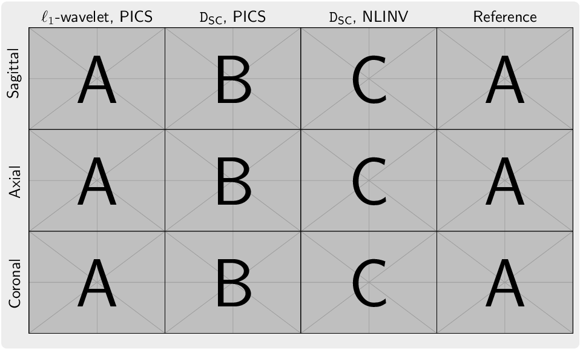

This figure is a template for comparing different imaging techniques or algorithms. It is structured as a grid with three rows and four columns, designed to display results across different planes (sagittal, axial, coronal) and methods (ℓ₁-wavelet, PICS, DSC, PICS, DSC, NLINV, Reference). 

Create a table of figures using latex
1. put sub-figures into folder `subfigs` and replace `example-image`with the corresponding names of sub-figures in fig1.tex, fig2.tex and so on.
2. compile fig.tex and use `pdfcrop` command to cut off the white margins

It should look like this.

